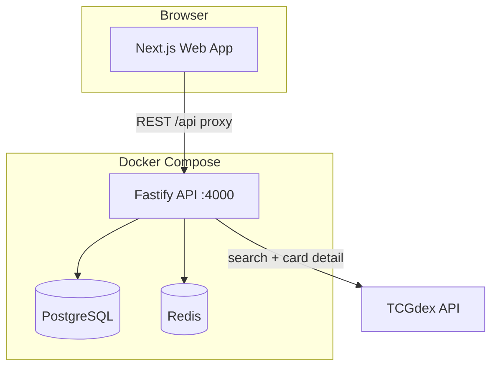
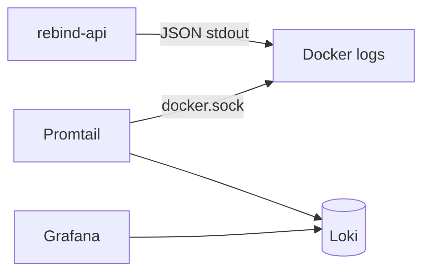

# Architecture

## Overview



The **web app** talks only to the **ReBind API**. The API owns users, binders, slots, price cache, and proxies TCGdex.

## Services

| Service | Port (dev) | Role |
|---------|------------|------|
| `web` | 3000 | Next.js UI; server components call API internally |
| `api` | 4000 | REST API, auth, business logic |
| `postgres` | 5432 | Primary data store |
| `redis` | 6379 | TCGdex response cache, rate-limit buffer |

## Request flows

### Place a card

1. User clicks empty slot → search modal opens
2. `GET /cards/search?q=pikachu` → API checks Redis → TCGdex on miss
3. User selects card → `PUT /binders/:id/pages/:n/slots/:row/:col`
4. API writes `BinderSlot` with `cardExternalId`, `cardName`, `imageUrl`, `variant`

### Binder value (Phase 3)

1. Nightly job collects distinct `cardExternalId` + `variant` from all slots
2. Fetches TCGdex pricing → upserts `card_prices`
3. Sums slot values → upserts `binder_valuations`

## Auth

- Email + password with bcrypt
- JWT access token (short) + refresh token (httpOnly cookie or DB-stored)
- All `/binders/*` routes require authentication

## Plan enforcement

```ts
// packages/shared — single source of truth
PLANS.free.maxBinders === 1
PLANS.collector.maxBinders === 50
```

API checks `binder.count({ userId })` before `POST /binders`.

## Caching

| Key pattern | TTL | Content |
|-------------|-----|---------|
| `tcgdex:search:{query}` | 1h | Search results JSON |
| `tcgdex:card:{id}` | 24h | Full card object |
| `price:{id}:{variant}` | 24h | Denormalized price row |

## Monorepo packages

```
packages/db       → Prisma schema, migrations, generated client
packages/shared   → Types, PLANS, errors, constants
apps/api          → Imports @rebind/db, @rebind/shared
apps/web          → Imports @rebind/shared (types only)
```

## Logging

The API writes **structured JSON** to stdout (Pino). A **separate** stack in `docker/logging/` collects logs from all Docker apps on the host via Promtail → Loki → Grafana.



- API containers are labeled `logging.enabled=true`, `logging.app=rebind-api`
- Other apps on the same server opt in with the same labels
- Not coupled to ReBind compose — deploy logging stack once per machine

See [LOGGING.md](./LOGGING.md).

## Production (Dockploy)

- Deploy via `docker-compose.prod.yml`
- PostgreSQL and Redis run as compose services with named volumes
- Web exposed on port 3000; API internal or exposed on 4000 behind Dockploy domain routing
- Secrets in Dockploy Environment tab → `.env` file

See [DEPLOYMENT.md](./DEPLOYMENT.md).

## Future considerations

- **Separate API domain:** `api.rebind.example.com` — configure `NEXT_PUBLIC_API_URL`
- **Background worker:** Price refresh as a cron container or API scheduled task
- **Object storage:** Only if we host custom binder cover images later
