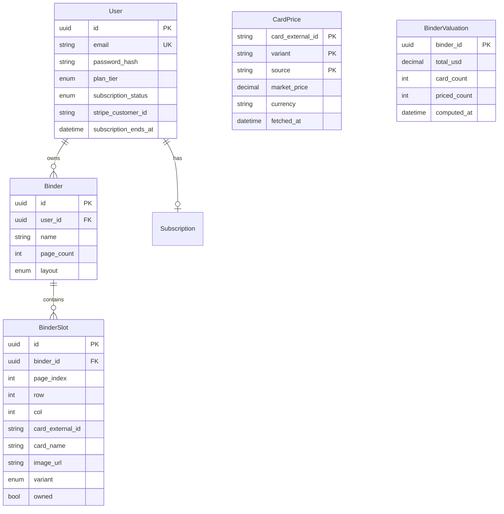

# Database

PostgreSQL via Prisma (`packages/db`).

## Entity diagram



## Tables

### `users`

| Column | Type | Notes |
|--------|------|-------|
| id | UUID | PK |
| email | VARCHAR | unique |
| password_hash | VARCHAR | bcrypt |
| plan_tier | ENUM | `free`, `collector` |
| subscription_status | ENUM | `none`, `active`, `past_due`, `canceled` |
| stripe_customer_id | VARCHAR | nullable |
| subscription_ends_at | TIMESTAMPTZ | nullable |

### `binders`

| Column | Type | Notes |
|--------|------|-------|
| id | UUID | PK |
| user_id | UUID | FK → users |
| name | VARCHAR | |
| page_count | INT | default 24 |
| layout | ENUM | `GRID_3X3`, `GRID_3X4` |
| created_at | TIMESTAMPTZ | |
| updated_at | TIMESTAMPTZ | |

### `binder_slots`

Unique constraint: `(binder_id, page_index, row, col)`

| Column | Type | Notes |
|--------|------|-------|
| card_external_id | VARCHAR | TCGdex id, nullable = empty slot |
| card_name | VARCHAR | denormalized |
| image_url | VARCHAR | denormalized |
| variant | ENUM | `normal`, `reverse`, `holo` — default `normal` |
| owned | BOOLEAN | default `true`; `false` = planned for binder but not yet owned |

Slots are **pre-created** when a binder is created (all pages × all cells) so the grid API is simple. A filled slot can represent a card the user already owns or one they still need to acquire for their physical binder.

### `card_prices` (Phase 3)

Composite PK: `(card_external_id, variant, source)`

Cache row for TCGdex/TCGPlayer/Cardmarket pricing. Not populated until pricing feature ships.

### `binder_valuations` (Phase 3)

One row per binder; updated on price refresh.

## Migrations

```bash
# From repo root with DB running
npm run db:migrate
```

## Conventions

- UUIDs for all primary keys
- `page_index` is 0-based internally, 1-based in UI
- `card_external_id` uses TCGdex format (e.g. `sv3-125`)
- Never store full TCGdex card JSON on slots — only display cache fields
