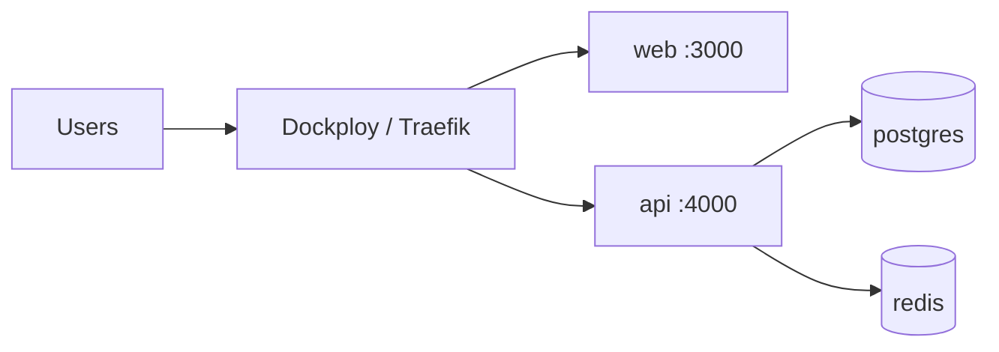

# Production Deployment (Dockploy)

ReBind deploys as a **Docker Compose** stack on [Dockploy](https://docs.dokploy.com/docs/core/docker-compose).

## Overview



Use `docker-compose.prod.yml` as the compose file in Dockploy.

## Dockploy setup

1. Create a new **Compose** application in Dockploy.
2. Connect the Git repository: `https://github.com/RamonDonadeu/rebind.git`
3. Set **Compose file** to `docker-compose.prod.yml`.
4. Configure the **Environment** tab (see below).
5. Click **Deploy**.

### Domain routing

In Dockploy, assign domains to services:

| Service | Suggested domain | Port |
|---------|------------------|------|
| `web` | `rebind.yourdomain.com` | 3000 |
| `api` | `api.rebind.yourdomain.com` | 4000 |

Set `NEXT_PUBLIC_API_URL=https://api.rebind.yourdomain.com` in environment.

## Environment variables

Dockploy writes variables from the UI to a `.env` file next to the compose file. Services load them via `env_file: .env` and `${VAR}` substitution — see [Dockploy Docker Compose docs](https://docs.dokploy.com/docs/core/docker-compose).

**After changing environment variables, redeploy** (rebuild) for containers to pick them up.

### Required

```bash
# App
NODE_ENV=production
WEB_PORT=3000
API_PORT=4000

# Public URL for browser → API calls
NEXT_PUBLIC_API_URL=https://api.rebind.yourdomain.com

# Database (match postgres service credentials)
POSTGRES_USER=rebind
POSTGRES_PASSWORD=<strong-random-password>
POSTGRES_DB=rebind
DATABASE_URL=postgresql://rebind:<password>@postgres:5432/rebind

# Redis
REDIS_URL=redis://redis:6379

# Auth (generate: openssl rand -base64 32)
JWT_SECRET=<random-secret>
JWT_REFRESH_SECRET=<random-secret>

# CORS — web origin
CORS_ORIGIN=https://rebind.yourdomain.com
```

### Optional (Phase 4 — Stripe)

```bash
STRIPE_SECRET_KEY=sk_live_...
STRIPE_WEBHOOK_SECRET=whsec_...
STRIPE_PRICE_COLLECTOR_MONTHLY=price_...
STRIPE_PRICE_COLLECTOR_YEARLY=price_...
```

## Volumes

`docker-compose.prod.yml` defines named volumes:

| Volume | Service | Purpose |
|--------|---------|---------|
| `postgres_data` | postgres | Database persistence |
| `redis_data` | redis | Cache persistence (optional) |

**Back up `postgres_data`** before major upgrades.

## Post-deploy: migrations

Run once after first deploy (or add an entrypoint script later):

```bash
docker compose -f docker-compose.prod.yml exec api npm run db:migrate:deploy
```

In Dockploy, use the terminal for the `api` container.

## Security checklist

- [ ] Strong `POSTGRES_PASSWORD` and `JWT_SECRET`
- [ ] Do not expose postgres/redis ports publicly (prod compose omits host ports)
- [ ] HTTPS via Dockploy domain + Let's Encrypt
- [ ] `CORS_ORIGIN` set to production web URL only
- [ ] Stripe webhook uses raw body verification

## CI (optional later)

GitHub Actions can run tests on PR; Dockploy pulls on push to `main` for auto-deploy.

## Rollback

Redeploy a previous Git commit in Dockploy, or:

```bash
git checkout <previous-tag>
# Trigger redeploy in Dockploy UI
```

## Monitoring

- API health: `GET https://api.rebind.yourdomain.com/health`
- Dockploy service logs per container

## Centralized logging (optional, recommended)

Deploy `docker/logging/docker-compose.yml` as a **separate Dockploy Compose app** on the same server:

1. Compose file path: `docker/logging/docker-compose.yml`
2. Promtail needs volume: `/var/run/docker.sock:/var/run/docker.sock:ro`
3. Expose Grafana (port 3000 → map to 3001 or custom) at e.g. `logs.yourdomain.com`
4. Set strong `GRAFANA_ADMIN_PASSWORD`
5. Do **not** expose Loki (3100) publicly

ReBind API is already labeled for collection. Query in Grafana: `{app="rebind-api"}`.

Full guide: [LOGGING.md](./LOGGING.md).

## Local vs production compose

| | `docker-compose.yml` | `docker-compose.prod.yml` |
|--|----------------------|---------------------------|
| Hot reload | Yes (volume mounts) | No |
| DB/Redis host ports | Exposed | Internal only |
| Build target | `development` | `production` |
| Restart policy | — | `unless-stopped` |
