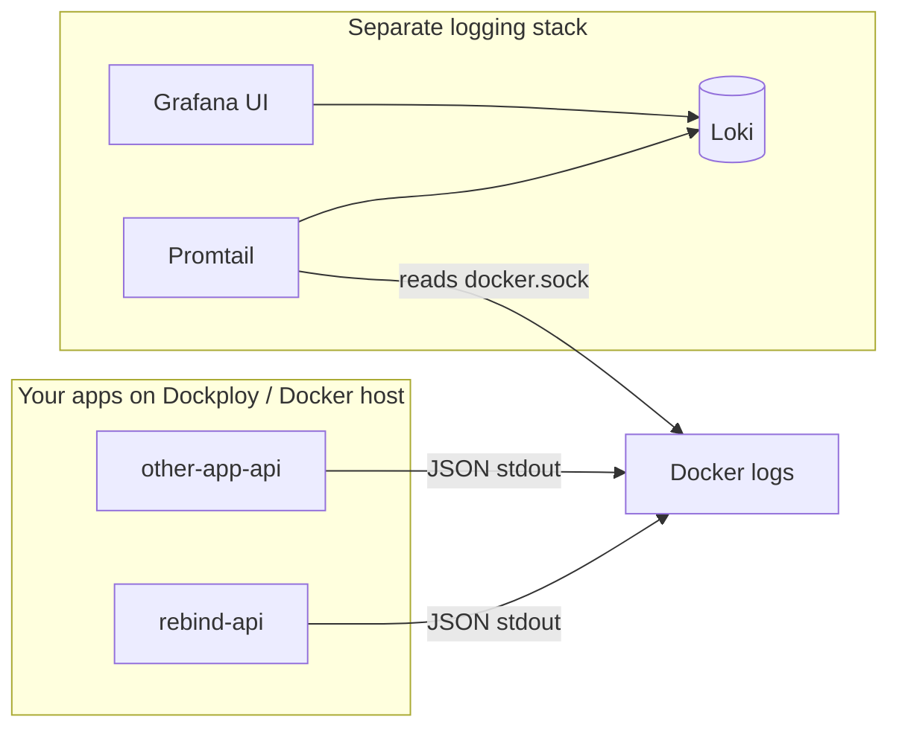

# Logging

ReBind uses **structured JSON logs** on the backend and a **separate, self-hosted log stack** you can point at multiple apps (ReBind, future projects, etc.) — similar in spirit to Coralogix, but free and under your control.

## Architecture



**Key idea:** Apps only write JSON to **stdout**. A separate logging app (Loki + Grafana + Promtail) collects and searches logs from every container you label.

## Backend logging (ReBind API)

Built on [Pino](https://getpino.io/) via Fastify.

### Log levels

| Level | Usage |
|-------|-------|
| `debug` | Request start, verbose internals (dev default) |
| `info` | Request completed, server started (prod default) |
| `warn` | 4xx responses, degraded health |
| `error` | 5xx, DB failures, caught exceptions |
| `fatal` | Server failed to start |

Set via `LOG_LEVEL` env var.

### Structured fields

Every log line includes:

```json
{
  "level": "info",
  "time": "2026-06-24T12:00:00.000Z",
  "service": "rebind-api",
  "environment": "production",
  "event": "request.complete",
  "method": "GET",
  "url": "/health",
  "requestId": "uuid",
  "statusCode": 200,
  "responseTimeMs": 12,
  "msg": "request completed"
}
```

### Environment variables

| Variable | Default | Description |
|----------|---------|-------------|
| `LOG_LEVEL` | `info` (prod) / `debug` (dev) | Minimum log level |
| `LOG_SERVICE_NAME` | `rebind-api` | `service` field — use different names per app |
| `LOG_PRETTY` | `false` | `true` = human-readable console (local dev) |

### Sensitive data

Passwords, tokens, and `Authorization` headers are **redacted** automatically.

### Code conventions

- Use `request.log` in route handlers (includes `requestId`)
- Use `event` field for machine-readable event names: `binder.created`, `auth.login_failed`
- Never `console.log` in the API — use the Fastify logger

```ts
request.log.info({ event: "binder.created", binderId, userId }, "binder created");
request.log.error({ err, event: "tcgdex.search_failed", query }, "card search failed");
```

## Central log stack (free, separate)

Located in `docker/logging/` — **not** part of ReBind's main compose file.

| Component | Role | Free? |
|-----------|------|-------|
| [Grafana Loki](https://grafana.com/oss/loki/) | Log storage & query | Yes (OSS) |
| [Promtail](https://grafana.com/docs/loki/latest/send-data/promtail/) | Ships Docker logs → Loki | Yes |
| [Grafana](https://grafana.com/oss/grafana/) | Search UI, dashboards | Yes |

### Start locally

```bash
# Terminal 1 — ReBind
cp .env.example .env
docker compose up

# Terminal 2 — Logging stack (once per machine)
cd docker/logging
cp .env.example .env
docker compose up -d
```

- **Grafana:** http://localhost:3001 (default `admin` / see `docker/logging/.env`)
- **Loki API:** http://localhost:3100

### Opt-in labels

Only containers with `logging.enabled=true` are collected. ReBind API is already labeled in compose files:

```yaml
labels:
  logging.enabled: "true"
  logging.app: "rebind-api"
  logging.env: "production"
```

### Query logs in Grafana

1. Open Grafana → **Explore** → datasource **Loki**
2. Example queries:

```logql
# All ReBind API logs
{app="rebind-api"}

# Errors only
{app="rebind-api"} | json | level="error"

# Slow requests (>500ms)
{app="rebind-api"} | json | responseTimeMs > 500

# All apps on this host
{logging_enabled="true"}
```

### Add another app

Any Docker app on the same host:

1. Emit **JSON logs to stdout** (Pino, Winston JSON, Python `structlog`, etc.)
2. Set `LOG_SERVICE_NAME=my-other-app`
3. Add labels to its compose service:

```yaml
labels:
  logging.enabled: "true"
  logging.app: "my-other-app"
  logging.env: "production"
```

Promtail picks it up automatically — no ReBind code changes needed.

## Production (Dockploy)

Run the logging stack as a **separate Dockploy Compose app** on the same server:

1. New Compose app → point at this repo (or copy `docker/logging/` to a dedicated repo)
2. Compose file: `docker/logging/docker-compose.yml`
3. Promtail needs access to `/var/run/docker.sock` (mount read-only)
4. Expose Grafana on a subdomain (e.g. `logs.yourdomain.com`)
5. Set a strong `GRAFANA_ADMIN_PASSWORD`

ReBind's `docker-compose.prod.yml` already labels the API container. No coupling between stacks.

### Security notes

- Do not expose Loki (3100) publicly — only Grafana behind auth
- Restrict Grafana to VPN or strong password + HTTPS
- Log redaction is app-side; never log secrets intentionally

## Alternatives

| Tool | Notes |
|------|-------|
| [OpenObserve](https://openobserve.ai/) | Single app, Coralogix-like UI, self-hosted free tier |
| [SigNoz](https://signoz.io/) | Logs + metrics + traces, heavier |
| [Vector](https://vector.dev/) | Replace Promtail as shipper |

The ReBind JSON stdout format works with any of these — swap the collector, keep the app logging code.

## Files

| Path | Purpose |
|------|---------|
| `apps/api/src/lib/logger.ts` | Pino / Fastify logger config |
| `apps/api/src/plugins/logging.ts` | Request + error logging hooks |
| `docker/logging/docker-compose.yml` | Loki + Grafana + Promtail stack |
| `docker/logging/promtail-config.yml` | Docker log scraping rules |
