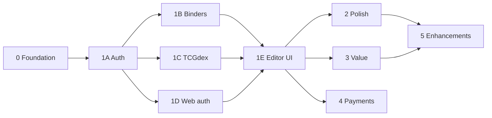

# ReBind — Product Plan

## Vision

A hobby-scale web app for organizing Pokémon TCG cards in digital binders — page by page, slot by slot — without managing money or trading.

> **For implementation:** use the detailed phase guides in **[docs/phases/](phases/README.md)**. Each phase is scoped for a single agent with dependencies, deliverables, and acceptance criteria.

## Target user

Personal collectors who want to mirror physical binders digitally, search cards easily, and (later) see approximate collection value.

## Core concepts

| Concept | Description |
|---------|-------------|
| **Binder** | Named collection with N pages (e.g. 24) and a grid layout (3×3 or 3×4) |
| **Page** | One side of a binder sheet; contains a grid of slots |
| **Slot** | Single cell; holds zero or one card reference |
| **Card reference** | TCGdex ID + display cache (name, image) + variant (normal/reverse/holo) |

## Monetization (freemium)

| Tier | Binders | Notes |
|------|---------|-------|
| **Free** | 1 | Full editing within that binder |
| **Collector** (paid) | Up to 50 | Stripe subscription; monthly or yearly |

**Downgrade behavior (soft lock):** When subscription ends, user can **view** all binders but cannot **create** new ones or **edit** binders beyond the free limit until they upgrade or delete down to one.

Plan limits live in `packages/shared/src/plans.ts` and are enforced in the API.

## Card data strategy

| Need | Provider | Cost |
|------|----------|------|
| Catalog, images, search | [TCGdex](https://tcgdex.dev/) | Free |
| Embedded market prices (MVP) | TCGdex `pricing` field | Free |
| Price history / graded (later) | PkmnPrices or Scrydex | Paid tier when needed |

Do **not** use [pokemontcg.io](https://pokemontcg.io/) — migrated to paid [Scrydex](https://scrydex.com/).

## Pricing data strategy

- **Do not** store prices on every slot or every card in the catalog.
- **Do** maintain `card_prices` cache for cards that appear in user binders.
- **Do** store `binder_valuations` snapshots with `computed_at` timestamp.
- Refresh: nightly job + on-demand "Refresh prices" button; 24h cache TTL.

## Phase overview

| Phase | Summary | MVP? |
|-------|---------|------|
| **0** | Repo, Docker, DB schema, logging | ✅ |
| **1A** | Auth API (JWT) | ✅ |
| **1B** | Binders + slots API | ✅ |
| **1C** | TCGdex proxy + Redis cache | ✅ |
| **1D** | Web login/register shell | ✅ |
| **1E** | Binder grid + card search UI | ✅ |
| **2** | Variants, drag-drop, mobile | |
| **3** | Collection value + price cache | |
| **4** | Stripe subscriptions | |
| **5** | History, export, share links | |

**Detail:** [docs/phases/README.md](phases/README.md)

## Non-goals (for now)

- Marketplace, trading, inventory for sale
- Graded card PSA pricing (until Phase 5+)
- Mobile native apps
- Multi-language UI (TCGdex supports multilingual card data; UI stays English first)

## Success criteria (MVP)

A user can sign up, create one binder with 24 pages, search "Pikachu", place cards in cells, reload the page, and see their binder intact.
