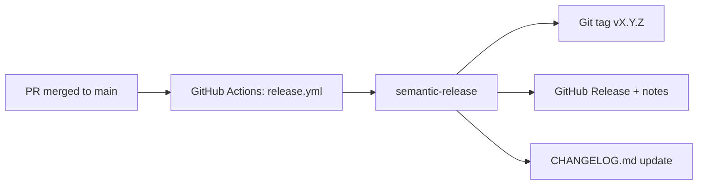

# Releases & Versioning

ReBind uses **automated semantic versioning** on every merge to `main`.

## How it works



1. A PR is merged into `main`
2. The [Release workflow](../.github/workflows/release.yml) runs
3. [semantic-release](https://semantic-release.gitbook.io/) analyzes commits since the last tag
4. If releasable commits exist, it bumps version, updates `CHANGELOG.md`, creates a Git tag, and publishes a [GitHub Release](https://github.com/RamonDonadeu/rebind/releases)

Release commits use `[skip ci]` to avoid re-triggering the workflow.

## Commit message format

Use [Conventional Commits](https://www.conventionalcommits.org/) in PR titles (squash merge) or individual commits:

```
<type>[optional scope]: <description>

[optional body]

[optional footer(s)]
```

### Types that trigger a release

| Type | Version bump | Example |
|------|--------------|---------|
| `feat` | **minor** (0.1.0 → 0.2.0) | `feat(api): add binder CRUD endpoints` |
| `fix` | **patch** (0.1.0 → 0.1.1) | `fix(web): correct login redirect` |
| `perf` | **patch** | `perf(api): cache TCGdex search results` |
| `revert` | **patch** | `revert: feat(api): add binder CRUD` |

### Breaking changes → major bump

```
feat(api)!: change binder slot API shape

BREAKING CHANGE: slot coordinates are now 0-based in all endpoints.
```

Or footer:

```
feat(api): change binder slot API shape

BREAKING CHANGE: slot coordinates are now 0-based in all endpoints.
```

### Types that do **not** trigger a release

| Type | Example |
|------|---------|
| `chore` | `chore: update dependencies` |
| `ci` | `ci: add release workflow` |
| `test` | `test(api): add auth unit tests` |
| `style` | `style(web): format tailwind classes` |

### Optional scopes

Use scopes to indicate the area:

- `feat(api):` — Fastify backend
- `fix(web):` — Next.js frontend
- `chore(db):` — Prisma / migrations
- `docs:` — documentation only (no release unless README scope with patch rule)

## PR merge strategy

**Recommended: Squash and merge** with a conventional commit as the squash title:

```
feat(web): add binder editor grid
```

If you merge with "Merge commit", every commit in the PR is analyzed — ensure each commit follows the convention.

## Manual / no release

If a merge only contains `chore`, `ci`, `docs`, `test`, or `style` commits, semantic-release exits without creating a new version.

## Configuration

| File | Purpose |
|------|---------|
| `.github/workflows/release.yml` | CI workflow (push to `main`) |
| `.releaserc.json` | semantic-release plugins and rules |
| `CHANGELOG.md` | Auto-updated changelog |

## Local dry run (optional)

```bash
npm install
npx semantic-release --dry-run
```

Requires `GITHUB_TOKEN` with repo access for full dry-run; otherwise use `--no-ci` locally.

## First release

After the workflow is on `main`, the first merge with a `feat:` or `fix:` commit will create `v0.2.0` or `v0.1.1` based on the current `0.1.0` in `package.json` and commit history.

To tag the initial scaffold manually before automation:

```bash
git tag v0.1.0
git push origin v0.1.0
```
