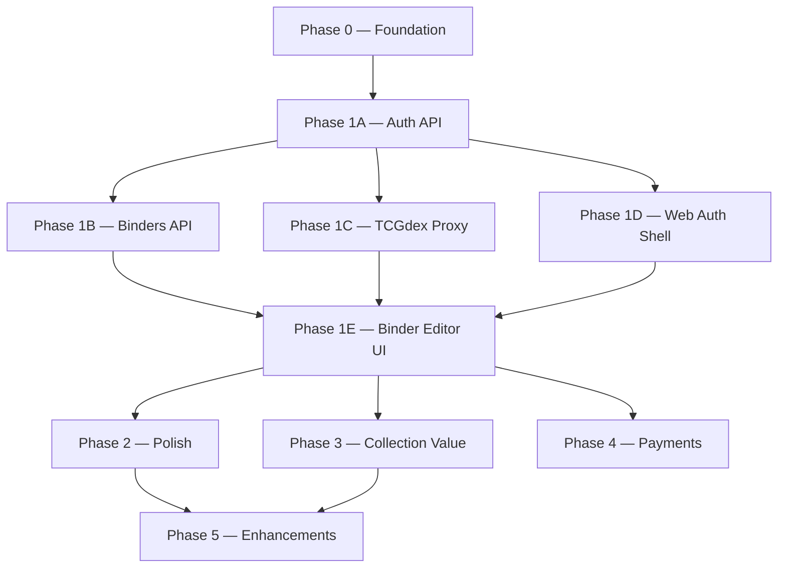

# ReBind — Development Phases

Agent-oriented breakdown of the build roadmap. **Pick one phase file and implement only that scope.**

## Phase map

## Quick reference

| Phase | Name | Layer | Depends on | MVP? |
|-------|------|-------|------------|------|
| [00](00-foundation.md) | Foundation | Infra | — | ✅ |
| [1A](01a-auth-api.md) | Auth API | API | 0 | ✅ |
| [1B](01b-binders-api.md) | Binders API | API | 1A | ✅ |
| [1C](01c-tcgdex-proxy.md) | TCGdex proxy | API | 1A | ✅ |
| [1D](01d-web-auth-shell.md) | Web auth shell | Web | 1A | ✅ |
| [1E](01e-binder-editor-ui.md) | Binder editor UI | Web | 1B, 1C, 1D | ✅ **MVP done** |
| [02](02-polish.md) | Polish | Full-stack | 1E | |
| [03](03-collection-value.md) | Collection value | Full-stack | 1E | |
| [04](04-payments.md) | Stripe payments | Full-stack | 1E | |
| [05](05-enhancements.md) | Enhancements | Full-stack | 2, 3 | |

## MVP definition

**MVP = Phases 0 through 1E complete.**

> A user can register, log in, create one binder (24 pages, 3×3 or 3×4), search cards via TCGdex, place them in slots, reload, and see their binder intact.

## Rules for all agents

1. **Read your phase file first** — only implement listed deliverables.
2. **Do not implement later-phase features** — see "Out of scope" in each file.
3. **Respect existing conventions** — `.cursor/rules/`, `AGENTS.md`, `packages/shared/src/plans.ts`.
4. **Enforce business rules in the API** — never only in the UI.
5. **Use structured logging** — `request.log` with `event` field ([LOGGING.md](../LOGGING.md)).
6. **Update your phase checklist** when done — mark items in the phase file.
7. **Do not edit unrelated phases' code** unless fixing a blocker you introduced.

## Parallel work

These can run in parallel after prerequisites are met:

| After | Parallel tracks |
|-------|-----------------|
| Phase 1A | **1B** + **1C** + **1D** (three agents) |
| Phase 1B + 1C + 1D | **1E** (single agent recommended) |
| Phase 1E | **2** + **3** + **4** (independent) |

## Shared references

| Doc | Use for |
|-----|---------|
| [ARCHITECTURE.md](../ARCHITECTURE.md) | System design |
| [API.md](../API.md) | Endpoint contracts |
| [DATABASE.md](../DATABASE.md) | Schema |
| [PLAN.md](../PLAN.md) | Product vision |
| `.cursor/skills/rebind-domain/` | Domain rules |
| `.cursor/skills/rebind-logging/` | Logging rules |

## Current status

| Phase | Status |
|-------|--------|
| 0 | 🟡 Mostly done — migrations verify pending |
| 1A | ✅ Complete |
| 1B | ✅ Complete |
| 1C | ✅ Complete |
| 1D | ✅ Complete |
| 1E | ✅ Complete — **MVP done** 🎉 |
| 2–5 | ⬜ Not started |

**MVP complete:** Phases 0–1E deliver register → login → create binder → search cards → place in slots → reload.

_Update this table when completing a phase._
